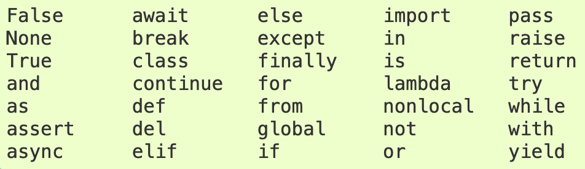

# Python Notes:

- Python is case sensitive.
- Spacing is important.
- [PEP8 Guidelines](https://www.python.org/dev/peps/pep-0008/).
- each line of code to **80** characters, though **99** is okay for certain use cases.  [IBM for this ruling](https://softwareengineering.stackexchange.com/questions/148677/why-is-80-characters-the-standard-limit-for-code-width).

# Data Types and Operator

* Data Types: Integers, Floats, Booleans, Strings
* Operators: Arithmetic, Assignment, Comparison, Logical
* Built-In Functions, Type Conversion
* Whitespace and Style Guidelines

| Operators | Operation                                      | Example          |
| --------- | ---------------------------------------------- | ---------------- |
| +         | Addition                                       | `(3 + 5)` # 8  |
| -         | Subtraction                                    | `(5 - 2)` # 3  |
| *         | Multiplication                                 | `(3 * 5)` # 15 |
| /         | Division                                       |                  |
| //        | Divides and rounds down to the nearest integer |                  |
| %         | Mod (the remainder after dividing)             | `(9 % 2)` # 1  |
| **        | Exponentiation                                 | `(3 ** 2)` # 9 |


**Bitwise operators**


| Operator | Meaning             | Example                     |
| -------- | ------------------- | --------------------------- |
| &        | Bitwise AND         | x & y = 0 (`0000 0000`)   |
|          | Bitwise OR          |                             |
| ~        | Bitwise NOT         | ~x = -11 (`1111 0101`)    |
| ^        | Bitwise XOR         | x ^ y = 14 (`0000 1110`)  |
| >>       | Bitwise right shift | x >> 2 = 2 (`0000 0010`)  |
| <<       | Bitwise left shift  | x << 2 = 40 (`0010 1000`) |

### Identity operators

In Python, `is` and `is not` are used to check
if two values are located on the same part of the memory. Two variables
that are equal does not imply that they are identical.

| Operator   | Meaning                                                                     | Example           |
| ---------- | --------------------------------------------------------------------------- | ----------------- |
| `is`     | `True`if the operands are identical (refer to the same object)            | `x is True`     |
| `is not` | `True`if the operands are not identical (do not refer to the same object) | `x is not True` |

### Membership operators

In Python, `in` and `not in` are the membership operators. They are used to test whether a value or variable is found in a sequence ([string](https://www.programiz.com/python-programming/string), [list](https://www.programiz.com/python-programming/list), [tuple](https://www.programiz.com/python-programming/tuple), [set](https://www.programiz.com/python-programming/set) and [dictionary](https://www.programiz.com/python-programming/dictionary)).

In a dictionary we can only test for presence of key, not the value.

| Operator   | Meaning                                                        | Example        |
| ---------- | -------------------------------------------------------------- | -------------- |
| `in`     | `True`if value/variable is**found**in the sequence     | `5 in x`     |
| `not in` | `True`if value/variable is**not found**in the sequence | `5 not in x` |

###### Variables and Assignment Operators

Variable I:

```
x = 3
y = 4
z = 5
```

Variable II :

```
x, y, z = 3, 4, 5
```


Note:

- only ordinary letters, numbers and underscores in your variable names.
- Can’t use Python's** reserved words, **or** "keywords,"** as variable names.

  
- The pythonic way to name variables is to use all lowercase letters and underscores to separate words.
- Variables name are snake case; connect the words with underscores

```
my_height = 58
my_lat = 40
my_long = 105
```

###### Assignment Operators

| Operator | Name                      | Example                    |
| -------- | ------------------------- | -------------------------- |
| `=`    | Assignment Operator       | `a = 7`                  |
| `+=`   | Addition Assignment       | `a += 1 # a = a + 1`     |
| `-=`   | Subtraction Assignment    | `a -= 3 # a = a - 3`     |
| `*=`   | Multiplication Assignment | `a *= 4 # a = a * 4`     |
| `/=`   | Division Assignment       | `a /= 3 # a = a / 3`     |
| `%=`   | Remainder Assignment      | `a %= 10 # a = a % 10`   |
| `**=`  | Exponent Assignment       | `a **= 10 # a = a ** 10` |

###### Integers and Floats : used for numeric values

* **int** - for integer values
* **float** - for decimal or floating point values

```
x = int(4.7)   # x is now an integer 4
y = float(4)   # y is now a float of 4.0
```

###### output:

```
>>> print(type(x))
int
>>> print(type(y))
float
```

###### Booleans, Comparison Operators, and Logical Operators

The bool data type holds one of the values `True` or `False`, which are often encoded as `1` or `0`, respectively.


### Comparison Operators

| **Symbol Use Case** | **Bool** | **Operation**      |
| ------------------------- | -------------- | ------------------------ |
| 5  <  3                   | False          | Less Than                |
| 5 > 3                     | True           | Greater Than             |
| 3 <= 3                    | True           | Less Than or Equal To    |
| 3 >= 5                    | False          | Greater Than or Equal To |
| 3 == 5                    | False          | Equal To                 |
| 3 != 5                    | True           | Not Equal To             |

And there are three logical operators you need to be familiar with:

| **Logical Use** | **Bool** | **Operation**                                          |
| --------------------- | -------------- | ------------------------------------------------------------ |
| 5  <  3 `and`5 == 5 | False          | `and`- Evaluates if all provided statements are True       |
| 5  <  3 `or`5 == 5  | True           | `or`- Evaluates if at least one of many statements is True |
| `not`5  <  3        | True           | `not`- Flips the Bool Value                                |


**Built-In Functions, Type Conversion**

+ print() - built in function that displays input value as a text in the output.
+ 


In general, there are two types of errors to look out for

* **Exceptions**
* **Syntax**

An **Exception** is a problem that occurs when the code
is running, but a 'Syntax Error' is a problem detected when Python
checks the code before it runs it.  For more information, see the Python
 tutorial page on [Errors and Exceptions](https://docs.python.org/3/tutorial/errors.html).
